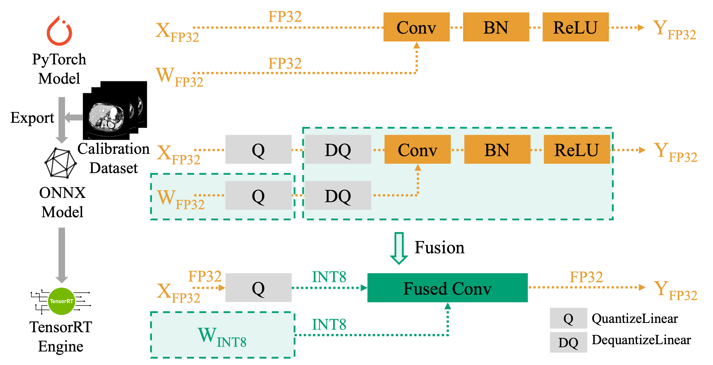

  

<h2>

  MedPTQ: A Practical Toolkit for Real Post-Training Quantization 
  in 3D Medical Image Segmentation

</h2>

We introduce **MedPTQ**, an open-source toolkit for real post-training quantization (PTQ) that implements true 8-bit (INT8) inference on state-of-the-art (SOTA) 3D medical segmentation models

## News

- **[2025-09-17]** 🔥 New — INT8 quantized **U-Net** and **TransUNet** have been released (see [MedPTQ Models](#medptq-models)).

## Method

  

**Overview of MedPTQ.** The top row illustrates the original FP32 pipeline, where both activation $X$ and weight $W$ are in full precision and pass through Conv–BN–ReLU sequentially. The middle row shows the simulated quantization stage: `QuantizeLinear` and `DequantizeLinear` nodes are inserted after both activations and weights to simulate INT8 quantization semantics, while the model still executes in FP32. The bottom row demonstrates the real INT8 TensorRT engine, where TensorRT fuses FP32 weights with their associated `QuantizeLinear` into INT8 weights, and merges activation `DequantizeLinear`, weight `DequantizeLinear` convolution, BN, and ReLU into a single fused convolution block. This fusion enables optimized INT8 convolution kernels, reducing memory traffic and improving efficiency while preserving accuracy.

## MedPTQ Models

<table>
  <tr>
    <th>Model</th>
    <th>Download</th>
    <th>Dataset</th>
  </tr>

  <tr>
    <td>U-Net</td>
    <td>
       
      
    </td>
    <td rowspan="2"><a href="https://www.synapse.org/Synapse:syn3193805/wiki/89480">BTCV</a></td>
  </tr>

  <tr>
    <td>TransUNet</td>
    <td>
       
      
    </td>
  </tr>
</table>

<!-- Progress -->

<strong>Release progress:</strong> 2/7

  

Released: U-Net, TransUNet • Coming soon: UNesT, VISTA3D, SegResNet, SwinUNETR, nnU-Net

## Acknowledgments

This research was supported by NIH R01DK135597 (Huo), DoD HT9425-23-1-0003 (HCY), NSF 2434229 (Huo), and KPMP Glue Grant. This work was also supported by Vanderbilt Seed Success Grant, Vanderbilt Discovery Grant, and VISE Seed Grant. This project was supported by The Leona M. and Harry B. Helmsley Charitable Trust grant G-1903-03793 and G-2103-05128. This research was also supported by NIH grants R01EB033385, R01DK132338, REB017230, R01MH125931, and NSF 2040462. We extend gratitude to NVIDIA for their support by means of the NVIDIA hardware grant. This work was also supported by NSF NAIRR Pilot Award NAIRR240055.