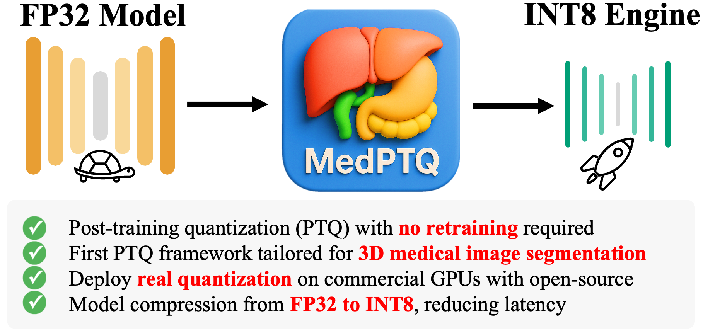

  

<h2>

  MedPTQ: A Practical Toolkit for Real Post-Training Quantization 
  in 3D Medical Image Segmentation

</h2>

We introduce **MedPTQ**, an open-source toolkit for real post-training quantization (PTQ) that implements true 8-bit (INT8) inference on state-of-the-art (SOTA) 3D medical segmentation models

## MedPTQ Models

## Acknowledgments

This research was supported by NIH R01DK135597 (Huo), DoD HT9425-23-1-0003 (HCY), NSF 2434229 (Huo), and KPMP Glue Grant. This work was also supported by Vanderbilt Seed Success Grant, Vanderbilt Discovery Grant, and VISE Seed Grant. This project was supported by The Leona M. and Harry B. Helmsley Charitable Trust grant G-1903-03793 and G-2103-05128. This research was also supported by NIH grants R01EB033385, R01DK132338, REB017230, R01MH125931, and NSF 2040462. We extend gratitude to NVIDIA for their support by means of the NVIDIA hardware grant. This work was also supported by NSF NAIRR Pilot Award NAIRR240055.